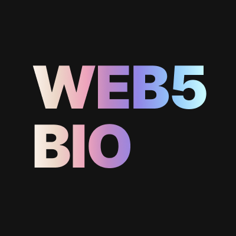

# Web5.bio



Web5.bio is a Web3 and Web 2.0 Identity Graph search service which is powered by [Next.ID](https://next.id). Web5.bio will provide a list of relevant identities when you are searching any Twitter handle, Ethereum address, ENS domain, or Lens profile. 

We're gradually making updates to Web5.bio. You may expect new features and data sources.

## Why it is called Web5.bio?

Web2 + Web3 = Web5.

## What are the data sources?

Web5.bio is powered by [Next.ID](https://next.id) Relation Service. The Relation Service is an aggregator and query service of Web2 and Web3 identities. Next.ID is indexing all identity data from public verifiable connections and on-chain records.

The supported identity platforms:

- Ethereum
- Ethereum Name Service (ENS)
- Lens
- Farcaster
- Unstoppable Domains
- Twitter
- Keybase
- Reddit
- GitHub
- .bit
- SPACE ID

The queries can be found here `utils/queries.js`. You can read [the Next.ID docs](https://docs.next.id/?utm_source=web5bio) to learn more.

## Can I remove my data?

No yet. Next.ID is indexing identity data from public verifiable connections and on-chain records. Revalidating data support is on the roadmap.

## Mobile App?

You can access Web5.bio on a mobile browser. However, a desktop browser currently provides the most optimized user experience, especially for visualizing Identity Graph.

## Local Dev

Run the development server:

```bash
npm i && npm run dev
```
```bash
yarn && yarn dev
```

## Contributing

Feel free to submit a pull request to propose bug fixes and improvements. Help is always appreciated. You may give feature feedbacks or bug report to [Web5.bio Twitter](https://twitter.com/web3bio) as well. 